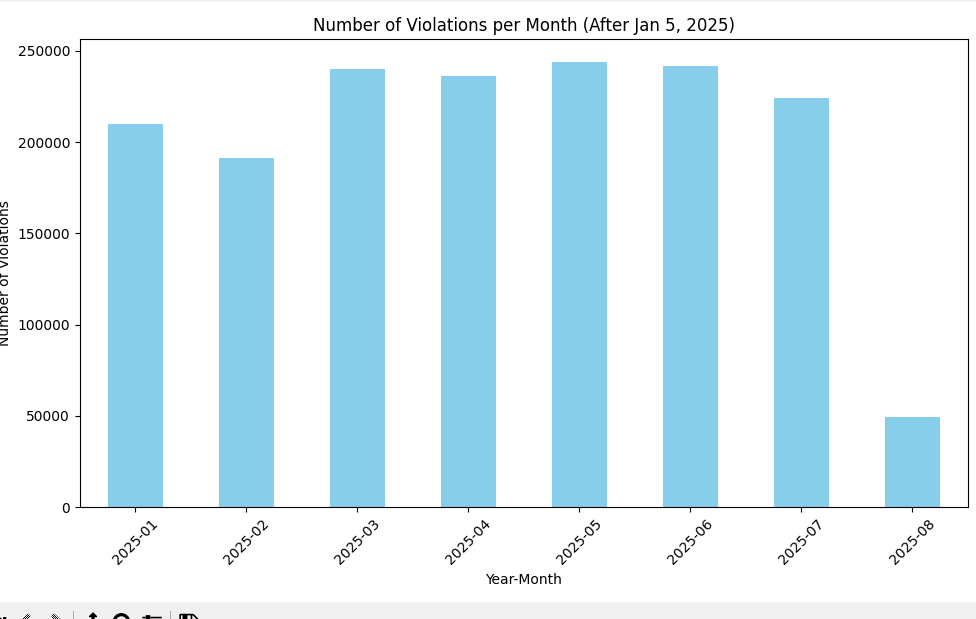

---

# 📊 Violation Trends Analysis — Datathon Project

Biggons intended on idenifying the correlation between the implementation of congestion pricing and ACE violatons within Manhattan's Central Business District.

# Report by Biggons
- Xavier Wright
- Michael Arias
- Matthew Arias
- Kevin Leon

---

## 📂 Dataset

The dataset consists of violation records spanning from **October 2019 through August 2025**. To better capture shifts in behavior, the data was divided into two main periods:

* **Pre-Jan 5, 2025**: October 2019 – January 2025
* **Post-Jan 5, 2025**: January 2025 – August 2025

---

## 📈 Visualizations

### 🔹 Violations Before January 5, 2025

(https://github.com/MHC-Datathon/Biggons/blob/main/Graphs/Post-Jan%205th.png)

* Early years (2019–2022) show **relatively stable, low violation counts**.
* From **2023 onward**, there is a gradual increase.
* A dramatic surge begins in **mid-2024**, with violations peaking at **over 300,000 per month** by late 2024.

---

### 🔹 Violations After January 5, 2025

* In the first half of 2025, violations remain high (**200K–250K monthly**).
* By **August 2025**, there is a **sharp drop to \~50K**, indicating a significant shift in activity.

---

## 🔍 Key Insights

* **Long-term trend:** Violations grew steadily before 2023, with exponential growth in late 2024.
* **Inflection point:** January 5, 2025 marks a turning point where violations stabilized at a high level and then sharply declined.
* **Possible explanation:** The implementation of congestion pricing directly correlates to the decreasing ACE violation. Congestion pricing leads to less vehices being in the streets of lower Manhattan, leading for less possiblities of ACE violations to occur

---

## 🛠️ Methodology

1. **Data Cleaning:** Removed incomplete entries, standardized dates, and aggregated monthly counts.
2. **Exploratory Data Analysis (EDA):** Identified trends, outliers, and structural breaks across time.
3. **Visualization:** Created comparative plots to highlight pre- and post-Jan 5 differences.
4. **Hypothesis Framing:** Considered external factors (policy enforcement, organizational changes) that could explain observed patterns.

---

## 🚀 Future Directions

* Conduct **time series forecasting** (e.g., ARIMA, Prophet) to predict future violation trends.
* Apply **causal inference methods** to test the effect of the Jan 5 intervention.
* Explore **categorical breakdowns** of violations for deeper insights, deepers insights would include idenifying what exact types of vehicles(ie; trucks, passenger vehicles, etc)are causing the violations.

---

## 📌 Repository Structure
* `environment.py` → Established the environments used in data processesing.
* `Graphs/` → Exported plots (Pre-Jan 5th & Post-Jan 5th).
* `README.md` → Project overview and findings.

---

## 👥 Team Contributions

This project was completed as part of the **MHC++ Datathon**.

* Data preprocessing: *\[Xavier Wright]*
* Visualization: *\[Xavier Wright, Michael Arias ]*
* Analysis & interpretation: *\[Matthew Arias, Michael Arias, Kevin Leon, Xavier Wright]*

